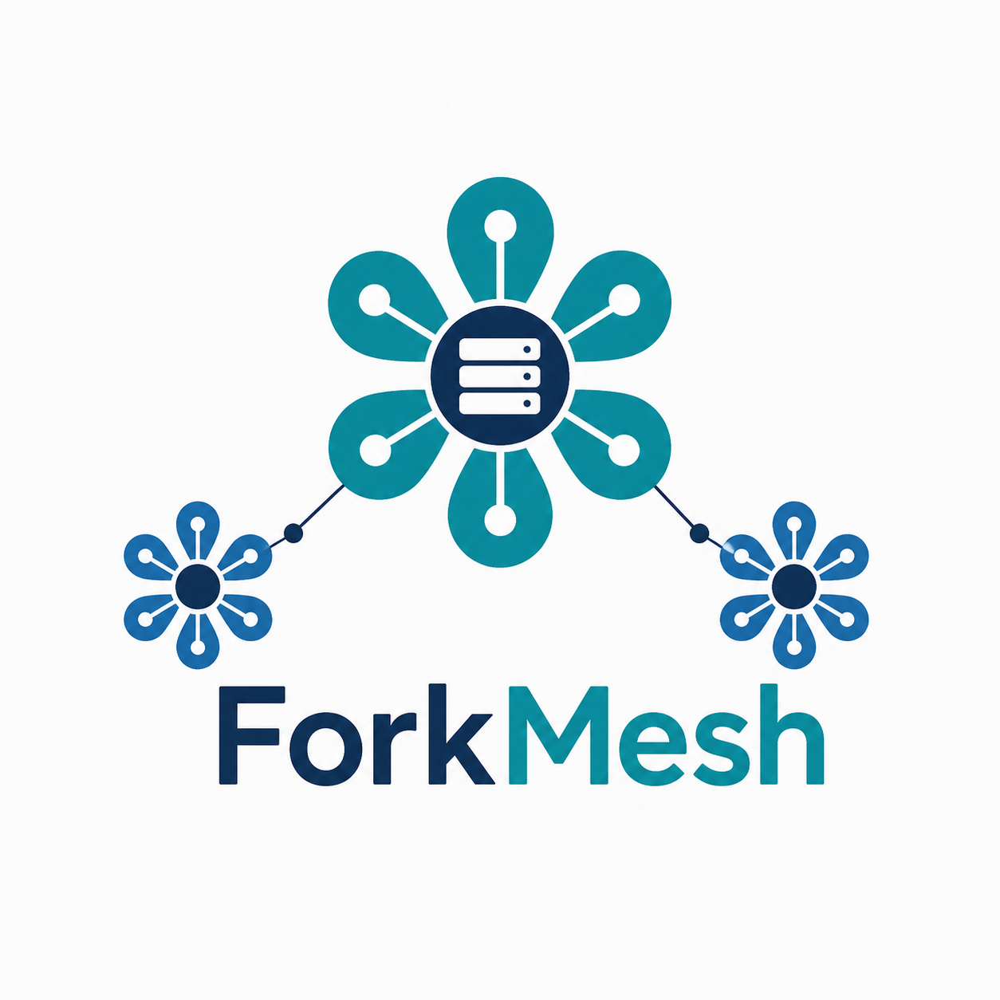

# ForkMesh

<p align="center">
  
</p>

<p align="center"><strong>Own your Git home. Keep it available through a mesh of independent mirrors.</strong></p>

ForkMesh is an open-source developer platform for publishing, browsing,
mirroring, discussing, and shipping software without making one hosting
provider the permanent owner of the project. Git remains the source of truth;
the edge routes traffic and collaboration metadata while repository bytes stay
on developer-operated hosts.

<p align="center">
  <a href="https://app.forkmesh.com">App</a> ·
  <a href="https://world.forkmesh.com">World</a> ·
  <a href="https://www.forkmesh.com/docs">Docs</a> ·
  <a href="https://app.forkmesh.com/api">API</a> ·
  <a href="https://forkmesh.com/status">Status</a>
</p>

## What works today

- Browse and clone public repositories through a stable URL backed by live,
  signed, integrity-checked mirrors.
- Create signed issues, discussions, pull requests, review conversations,
  projects, milestones, and release metadata that travel with the repository.
- Assign work to Codex or Claude Code, run multiple agents in isolated
  worktrees, inspect live transcripts and diffs, and turn finished work into a
  pull request.
- Run repository Actions on labeled desktop or server nodes with streaming
  logs, artifacts, checks, and release publishing.
- Chat in authenticated repository rooms, share encrypted private notes, and
  use ActivityPub discovery without giving the relay custody of Git history.
- Switch between local and remote ForkMesh accounts from the avatar menu and
  manage the relay instance and mirror servers associated with each session.
- Operate a Qt desktop node, a compact Go mirror server, a Flutter mobile
  client, and editor extensions from one repository.
- Explore repositories, active nodes, agents, and collaboration activity in
  ForkMesh World.

ForkMesh is actively developed and its public network is real, but it is not a
finished replacement for every centralized forge workflow. The public roadmap
and acceptance evidence live in [`.forkmesh/projects`](.forkmesh/projects) and
[`.forkmesh/issues`](.forkmesh/issues).

## Architecture

The hosted edge is split by responsibility so a busy 3D scene, documentation
crawl, or API burst cannot consume the same deployment and isolate budget.

```text
forkmesh.com / www.forkmesh.com  →  www          landing, marketing, docs, blog
app.forkmesh.com                 →  edge control health, version, mirror identity
                                      └→ app     Git UI + REST, WebSockets, routing
world.forkmesh.com               →  world        optional interactive 3D network
                                              │
                                              ▼
                                   independent server mirrors
                                   (Git bytes + signed health)
```

Browser and native clients use the configured `https://app.forkmesh.com`
app/API origin. Credentialed CORS is restricted to configured trusted origins;
preflights, CSRF checks, and WebSocket upgrades use the same origin policy.
Each Cloudflare unit has its own deploy action and input fingerprint, so a
change deploys only the workers it can affect.

The App deploy action also publishes its small JavaScript control plane. That
script handles runtime-independent health and mirror bootstrap routes and owns
the minute trigger; the existing App-owned Durable Object performs the actual
maintenance work in the Python/Pyodide Worker. The bootstrapper configures
both scripts automatically, so a self-host still has one App hostname and one
App deployment target.

The combined app is also the self-hosting unit. Deploy it at an address such as
`forkmesh.example.com` to get the complete Git, account, API, realtime, and
routing surface. A World deployment at `forkmesh-world.example.com` is
optional; ForkMesh does not require operators to reproduce the public
marketing site or maintain a second backend domain. The Python App requires a
Cloudflare Workers Paid account: its normal authenticated and repository paths
exceed the free plan's 10 ms CPU ceiling even after build-time compaction.

The API stores discovery, authorization, collaboration, and health metadata in
Cloudflare D1, KV, and Durable Objects. It does not retain Git packfiles. Clone
and repository-read traffic is routed to an eligible direct HTTPS mirror whose
signed proof is fresh and whose refs match an accepted source revision.

## Install

Install the current desktop release with its published SHA-256 verification:

```sh
curl -fsSL https://forkmesh.com/install.sh | bash
```

Or build the desktop application from source:

```sh
git clone https://forkmesh.com/forkmesh/forkmesh
cd forkmesh
./desktop/run.sh
```

Continue with [Getting started](www/docs/getting-started.md) for first-run
setup, or the [desktop guide](www/docs/qt-client.md) for dependencies,
troubleshooting, and development workflows.

### Run a mirror server

The headless Go service supervises repository synchronization, the direct Git
gateway, signed endpoint publication, and its Cloudflare Tunnel. Production
hosts can be created and checked from **App → Network → Hosts**. For a manual
build:

```sh
cd server
go test ./...
go build ./cmd/forkmesh-mirror-node
```

Deployment and recovery details are in the
[mirror-node operations guide](www/docs/operations/mirror-node.md).

### Develop the Cloudflare services

The Python Worker source, app assets, D1 migrations, deployment coordinator,
and edge test suite live together in `app/`. The deploy coordinator can target
`app`, `www`, or `world`, or calculate the changed targets from Git:

```sh
cd app
./deploy.sh dry-run
./deploy.sh changed
```

Production credentials belong in the ignored, responsibility-scoped
environment files described by the deployment guide. Never commit them.
Routine `./deploy.sh secrets` calls preserve the live mirror-router identity;
an intentional trust-root change uses `./deploy.sh rotate-mirror-router`, which
validates the local Ed25519 pair and rotates it through a fail-closed edge state.

## Repository layout

```text
.forkmesh/   portable project records, workflows, releases, and pull data
.github/     forge compatibility and repository automation
app/         Git UI, API/relay, accounts, migrations, tests, and deploy control
desktop/     Qt 6 desktop node and desktop-owned icons
extensions/  editor integrations
mobile/      Flutter client and owned mobile Git engine work
server/      Go mirror daemon and server packaging
tools/       reviewed standalone maintenance, MCP, and security helpers
world/       ForkMesh World worker and 3D client assets
www/         landing site, marketing pages, authored docs, and blog
```

Issues, pull requests, discussions, commits, workflows, and releases are
designed to remain useful from a clone. Pull-request records live under
`.forkmesh/pulls`; hosted views are projections of repository state rather
than the only copy of it.

## Developer interfaces

The public API page at [app.forkmesh.com/api](https://app.forkmesh.com/api)
provides live service statistics and entry points. Representative routes are:

```text
GET  /api/repositories
GET  /api/repo/{owner}/{repo}/tree
GET  /api/status
WS   /api/repo/{owner}/{repo}/rooms/{room}/ws
```

`tools/forkmesh_mcp_server.py` exposes read and signed-write tools over MCP for
compatible coding agents. Generate a connector token in **Desktop → Settings →
MCP** for write access; omit it for browse-only access. Tokens are device-local
and revocable.

## Security model

- Node and protocol actions use local Ed25519 identities and signed records.
- Public mirror eligibility requires a fresh account-bound signature, healthy
  direct HTTPS endpoint, allowed status, and an integrity-matching repository
  proof.
- The relay stores routing and collaboration data, not Git packfiles.
- Default repository chat is authenticated shared-key encryption, not
  end-to-end encryption from the relay operator. Use a separately exchanged
  participant passphrase where operator confidentiality is required.
- Owner-device agent transcripts and steering payloads are hybrid-encrypted;
  the browser and hosted platform do not receive an administrative decryption
  override.
- Legacy Worker-custodied bounty deposits and automatic payouts are frozen.
  Current rewards use reviewed, non-custodial signing and externally owned
  wallets.

See [SECURITY.md](SECURITY.md) for reporting and the security documentation in
[www/docs/security](www/docs/security) for protocol-specific boundaries.

## Contributing

Start with [CONTRIBUTING.md](CONTRIBUTING.md). Keep changes scoped, add the
closest contract or integration test, and run the affected component suite
before opening a pull request. The complete engineering and operations index is
[www/docs/README.md](www/docs/README.md).

ForkMesh measures progress by shipped evidence: an implementation is not called
complete until its compatibility, security, documentation, observability, and
rollout gates match the claim. If you want to help, run a node, mirror a project,
pick an issue, or give an agent a well-bounded task.

## License

ForkMesh is released under the terms in [LICENSE](LICENSE).
